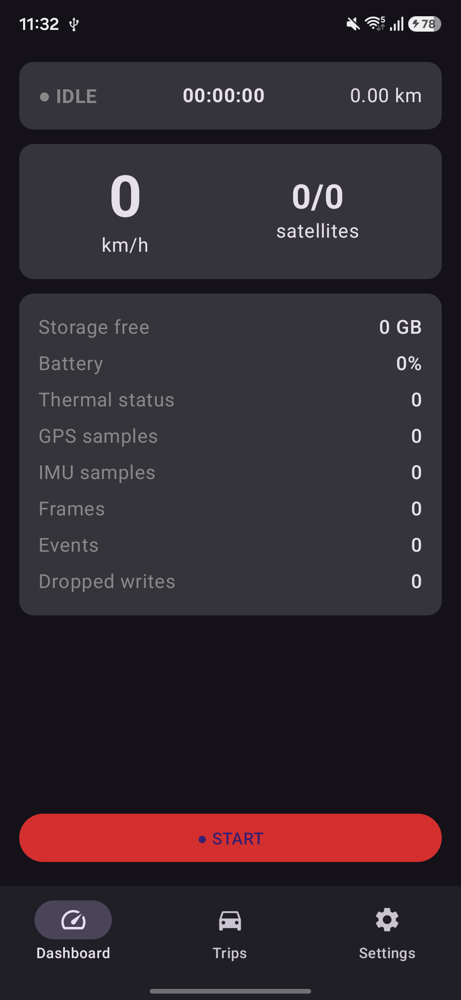
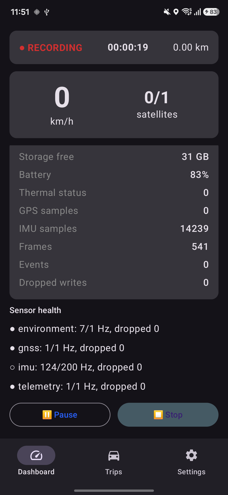
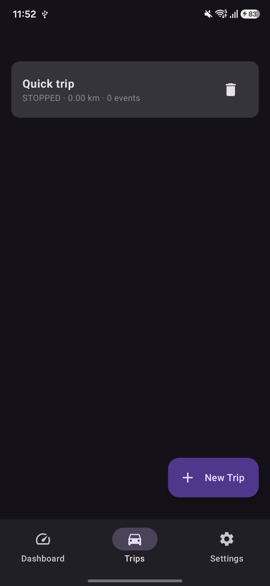
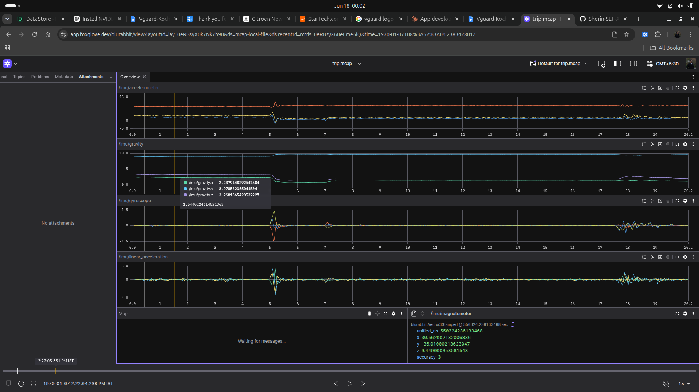
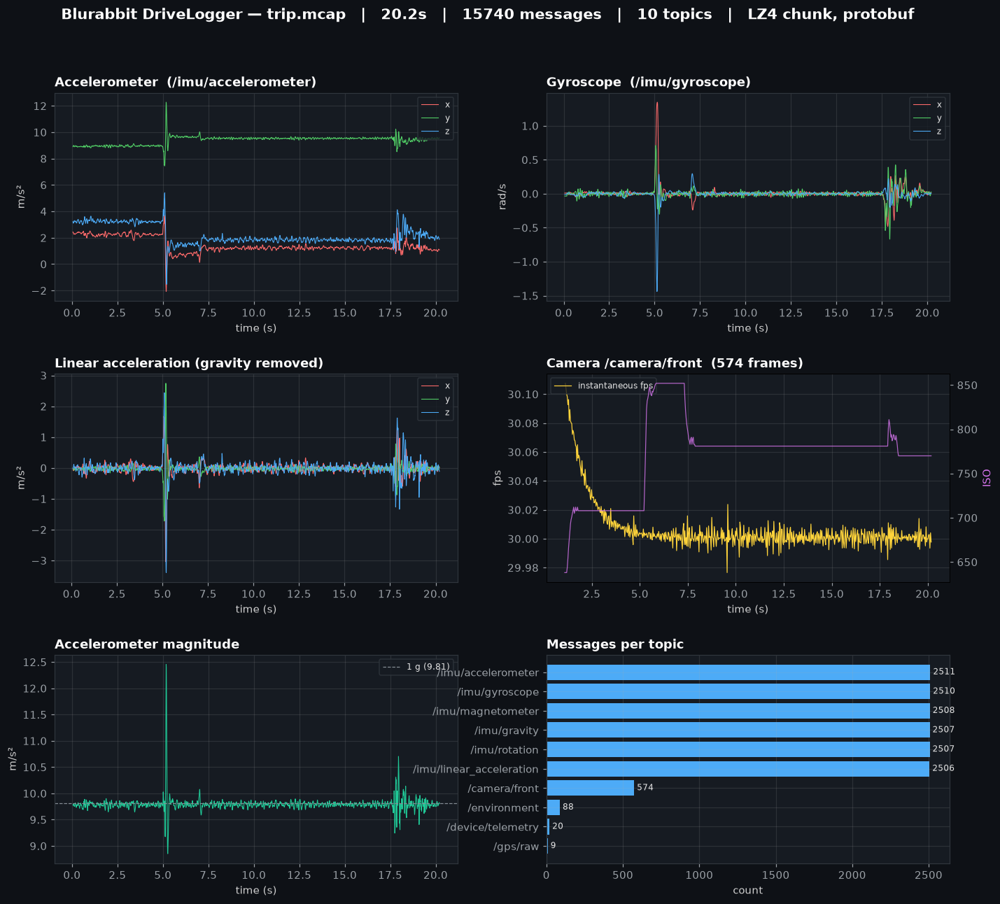

# Blurabbit DriveLogger

Production-grade Android platform that turns phones into autonomous-vehicle data-acquisition
devices. It records synchronized multi-sensor data and exports **standards-compliant MCAP**
(`trip.mcap`) plus an **MP4 video sidecar** (`trip.mp4`) and a dataset **`metadata.json`** —
suitable for autonomous driving, HD mapping, localization, SLAM, robotics, telematics, and AI
dataset generation.

**Built for the autonomous data collection community — by [Blurabbit](https://blurabbit.com).**

> Kotlin · Jetpack Compose · Clean Architecture · MVVM · Hilt · CameraX · Room · WorkManager ·
> Foreground Services · custom Kotlin MCAP writer (protobuf + LZ4).

---

## Screenshots

| Dashboard (idle) | Recording (live) | Trips |
|---|---|---|
|  |  |  |

**A recorded trip opened natively in Foxglove Studio** — every topic decodes from the embedded
protobuf schemas (IMU, gravity, gyro, linear accel, map, magnetometer):



**Sensor data decoded straight from `trip.mcap`** (official `mcap` reader → protobuf → plot):



---

## Why a custom MCAP writer?

Foxglove ships official MCAP libraries for C++, Go, Python, Rust, Swift, and TypeScript — **but
not Java/Kotlin**. So `:core:mcap` implements the [MCAP spec](https://mcap.dev/spec) directly:
opcode records, lazily-registered schemas/channels, LZ4-compressed chunks with message indexes,
a full summary section (chunk index + statistics + summary offsets), CRC integrity, and a
crash-recovery tool. Messages are **protobuf** using **Foxglove well-known schemas**
(`foxglove.LocationFix`) plus custom `blurabbit.*` types, so trips open natively in Foxglove Studio.

Video frames are **never** stored in MCAP — only `blurabbit.CameraFrameMeta` (frame id, timestamp,
exposure, ISO, focal length, MP4 reference). This keeps logs small while preserving exact
frame↔sensor synchronization.

## Timestamp synchronization (the linchpin)

Every stream is aligned to one timebase: **`SystemClock.elapsedRealtimeNanos()`**.
`System.currentTimeMillis()` is used only for human-facing display/metadata, never for alignment.
`:core:clock` maps each sensor's native epoch onto the unified clock (`ClockSynchronizer`),
monitors drift/monotonicity (`DriftMonitor`), and feeds warnings to the data-quality pipeline.

---

## Module map

```
:app          Compose UI (Dashboard/Trips/TripDetail/Settings), ViewModels, nav, Hilt host
:core:common  dispatchers, Outcome, Topics
:core:clock   MonotonicClock, ClockSynchronizer, DriftMonitor
:core:proto   .proto schemas (foxglove + blurabbit) → protobuf-java (descriptors at runtime)
:core:mcap    McapWriter, McapAsyncWriter (actor), LZ4 chunks, McapRecoveryTool
:domain       models, repository interfaces, use cases (pure Kotlin)
:data         Room (trips/sessions/events/uploads/device_health/sensor_health) + repos
:sensors      SensorSource seam + IMU/GNSS (covariance, DOP, raw measurements)/Environment/Telemetry (+ OBD example)
:events       EventDetector + pluggable EventRule set
:recording    RecordingForegroundService, TripRecorder, CameraController, AudioController + YAMNet, MetadataGenerator
:upload       CloudStorageProvider, S3/MinIO (SigV4 multipart, resumable), Azure stub, UploadWorker
:app …        export (zip + share), HD-map enrichment (OSM Overpass) alongside the Compose UI
```

Dependency direction: `app → recording/events/upload → sensors → data → domain`; everything may
use `:core:*`; `:domain` has no Android dependencies.

## Additional capture & tooling (no extra hardware)

Stock-Android upgrades that push the dataset toward AV grade on a phone alone:

- **GNSS for fusion/PPK** — `/gps/fix` carries an ENU position **covariance**; `/gps/raw` adds
  **PDOP/HDOP/VDOP** (from NMEA GSA); `/gnss/measurements` logs **raw `GnssMeasurement` + `GnssClock`**
  (pseudorange/carrier-phase) for offline PPK/RTKLIB (full-tracking requested on Android 12+).
- **Camera↔motion fusion** — `CameraFrameMeta` adds per-frame **rolling-shutter skew** and the sensor
  **timestamp source**.
- **Audio** — a 16 kHz `audio.wav` sidecar + `/audio/microphone` level metadata, with an **on-device
  YAMNet (TFLite)** classifier emitting **siren/horn** `/events`. The model is an asset (see below);
  without it, audio still records and detection is simply disabled. Each chunk's `(sample_index,
  unified_ns)` anchor comes from the **audio HAL clock** (`AudioRecord.getTimestamp`, boottime) — not
  flush time — so alignment is jitter-free. A self-describing **`audio.wav.json`** sidecar carries the
  **measured** sample rate (fit from the anchors), the device→wall offset, and the raw anchors:

  ```python
  # audio.wav.json → sample-accurate wall time for any PCM sample
  slope, intercept = least_squares(meta["anchors"])          # ns/sample, ns at sample 0
  def wall_ns(sample_i): return slope*sample_i + intercept + meta["device_to_wall_offset_ns"]
  ```
- **Export / share** — bundle a trip into `trip_<id>.zip` (MP4 optional) and share via the system
  chooser (FileProvider).
- **HD-map context** — an offline `WorkManager` job queries **OSM Overpass** along the trip's GPS
  track and writes `hdmap.json` (road class / lanes / speed limit / oneway); included in the export.

> **YAMNet model:** drop `yamnet.tflite` (TF-Hub, *with metadata*) into `recording/src/main/assets/`.
> It is intentionally uncommitted; see `assets/README_yamnet.txt`.

## Extensibility (designed-in)

- **New sensor** (RTK GNSS/ZED-F9P, external IMU, OBD-II, CAN, LiDAR, USB cam): implement
  `SensorSource`, add a `.proto`, bind it `@IntoSet` in `SensorModule` — new MCAP topic, **zero**
  pipeline changes. See `ObdSensorSource` for the seam.
- **New event rule** (e.g. TFLite/LiteRT): implement `EventRule`, bind `@IntoSet` in `EventModule`.
- **AI annotation pipeline** (YOLOv11, RT-DETR, Grounding DINO, SAM2): reserved topics
  `/annotations`, `/objects`, `/tracks` in `Topics`; add an `Annotator` post-processor writing a
  sidecar MCAP.
- **New cloud backend**: implement `CloudStorageProvider`, bind `@IntoMap` keyed by `CloudProvider`.

---

## Build & run

Requirements: JDK 17, Android SDK 35, an internet connection for the first dependency sync.

```bash
./gradlew :core:clock:test :core:mcap:test :events:test :upload:test   # JVM unit tests
./gradlew assembleDebug                                     # build the APK
./gradlew installDebug                                      # install on a connected device
```

Grant **Camera**, **Location**, and **Notifications** at first launch, then press **● START** on
the Dashboard. Stop the trip to finalize `trip.mcap`, `trip.mp4`, and `metadata.json` under
`Android/data/com.blurabbit.drivelogger/files/trips/<tripId>/`.

### Verify the output

```bash
adb pull /sdcard/Android/data/com.blurabbit.drivelogger/files/trips/<id>/trip.mcap
mcap doctor trip.mcap        # reference CLI — expect no errors
mcap info trip.mcap          # topics, message counts, chunk stats
```

Then open `trip.mcap` in **Foxglove Studio**: `/gps/fix` plots on a map, `/imu/*` and `/events`
render on timelines; play the MP4 against `/camera/front` frame metadata.

### Cloud upload

Enter S3/MinIO endpoint, region, bucket, and keys in **Settings** (encrypted via Android
Keystore). On a trip's detail screen tap **Upload**; `UploadWorker` runs a multipart upload on an
unmetered network that is **resumable** (completed parts are persisted and skipped on retry) and
integrity-checked via **per-part `x-amz-checksum-sha256`** that S3/MinIO validates server-side.

---

## Testing

- **JVM unit:** MCAP round-trip + recovery (`:core:mcap`), clock offset/drift (`:core:clock`),
  event rules (`:events`).
- **Recommended next:** validate generated files against the `mcap` CLI in CI; Room DAO/migration
  instrumented tests; CameraX smoke test.

## Performance

Dedicated `HandlerThread` per high-rate sensor; hardware sensor batching (`maxReportLatency`);
bounded-channel backpressure into a single MCAP writer thread; counters aggregated in memory (DB
off the hot path); tunable chunk size / LZ4; storage + thermal guards surfaced as warnings.

## Security

Credentials in `EncryptedSharedPreferences` (Keystore master key); TLS-only uploads with per-part
SHA-256 checksums validated server-side; app-private scoped storage; runtime permissions; R8
keep-rules for protobuf/Room/Hilt/lz4.

## Status

Built with real, production-grade code: clock, MCAP writer/recovery, Room, all sensor sources,
event engine, recording service + camera, S3/MinIO upload, and the full Compose UI.
Intentionally stubbed behind interfaces: Azure Blob provider, ML event rule, AI annotation
pipeline, and external-hardware sources (one OBD example included).

A sample recording is included under [`sample_trip/`](sample_trip/) — `trip.mcap`,
`metadata.json`, and `calibration.json`. Drop the `.mcap` into [Foxglove Studio](https://foxglove.dev)
to explore it.

---

Made for the autonomous data collection community by **[Blurabbit](https://blurabbit.com)**.
Contributions, sensor integrations (RTK GNSS, OBD-II, CAN, LiDAR), and dataset tooling are welcome.
